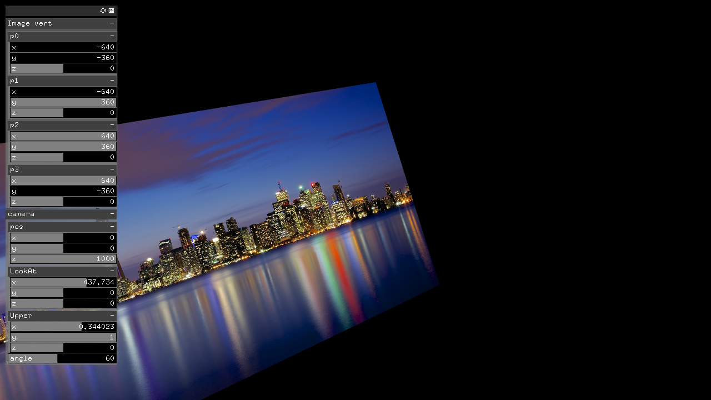

# study__Vbo_x_texture & ofCamera #

## 環境 ##
*	OS X El Capitan(10.11.6)
*	Xcode : 7.2
*	oF : 0.9.0

## add on ##
ofxGui  
ofxXmlSettings  

## Contents ##
Vboの頂点とtextureの頂点を関係付けて描画する。  
例えば、ただの矩形でなく、各頂点をゆらゆらさせることで、イラストをanimateすることなどが可能になる。  

ofCameraの使い方も同時にstudy.  

  

## Device ##

## note ##

